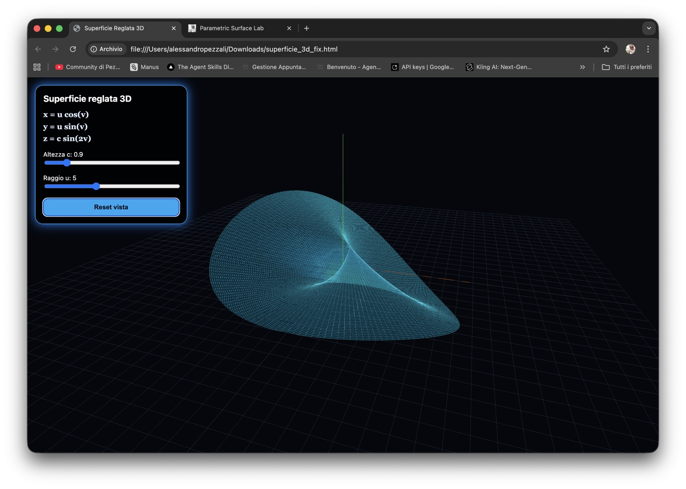

# Parametric Surface Lab

A lightweight 3D web app for exploring parametric surfaces directly in the browser.

No installation. No backend. Just math and interaction.

---

## Preview



---

## Live Demo

https://pezzaliapp.github.io/ParametricSurfaceLab/

Mirror / website page:

https://www.alessandropezzali.it/ParametricSurfaceLab/

---

## What it does

Parametric Surface Lab renders a mathematical surface in real time using Three.js.

Base formula:

```text
x = r cos(v)
y = r sin(v)
z = c sin(kv)
```

The app lets you modify the surface directly from the UI.

---

## Controls

- **Altezza c** — vertical amplitude
- **Raggio u** — surface radius
- **Frequenza k** — number of waves
- **Torsione** — twist deformation
- **Radiale** — radial deformation
- **Classic / Twist / Radial flower** — different surface modes
- **Animation ON/OFF**
- **Grid ON/OFF**
- **Preset bello** — quick visual reset for a clean presentation view

---

## Features

- Real-time 3D parametric surface
- Transparent surface + wireframe
- Interactive mouse/touch camera
- Responsive UI
- PWA-ready structure
- Runs fully client-side

---

## Tech

- Three.js
- Vanilla JavaScript
- HTML/CSS
- Progressive Web App base

---

## Roadmap

- Multiple mathematical presets
- STL / OBJ export
- Saved configurations with localStorage
- Presentation mode
- Offline library bundling

---

## Philosophy

Simple tools. No friction.  
Everything runs in your browser.

PezzaliAPP.
